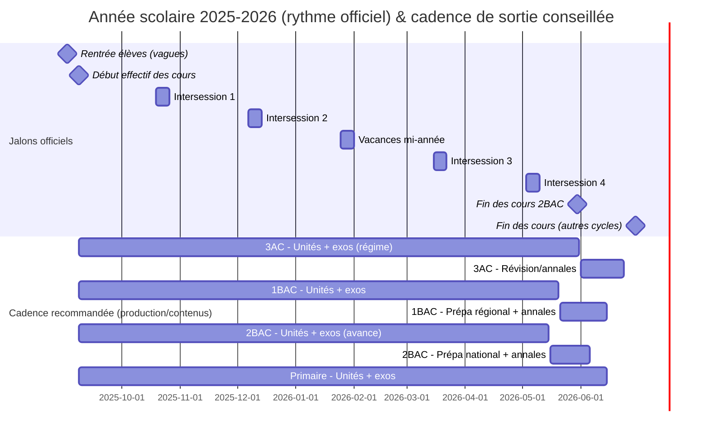

# Plateforme e‑learning 100% marocaine : cartographie officielle (primaire–collège–lycée), calendrier 2025‑2026, unités, taxonomie et plan d’inventaire

## Résumé exécutif

Objectif : bâtir une plateforme e‑learning « 100% entity["country","Maroc","north africa country"] » alignée sur les programmes, le rythme réel de l’année scolaire et les exigences d’évaluation (contrôle continu + examens). Le levier principal de réussite n’est pas « plus de contenu », mais une **couverture mesurée** (par filière/année), une **granularité “unité → ressources”** et une **taxonomie stable** (niveau, filière, unité, compétence, difficulté, tags examens) qui permet recherche, parcours et réutilisation.

Sources primaires mobilisées : (1) **mouqarrar d’organisation de l’année scolaire 2025‑2026** (rentrée, vacances, fenêtres de contrôles, périodes de préparation et dates d’examens), (2) **guide officiel du candidat (baccalauréat)** pour l’inventaire des branches (général/technologique/professionnel), (3) référentiels/éléments de programme (maths, PC, SVT, SEG, français) publiés dans un document officiel ministériel à usage d’épreuves orales (utile pour extraire des unités/chapitres). citeturn19view0turn19view1turn21view1turn21view2turn30view1turn30view3turn38view0turn39view0turn39view2turn39view3

Priorisation recommandée (impact/coût) : **3AC + 1BAC + 2BAC** (matières à forte demande et fortement “annales‑driven”), puis Tronc Commun, puis collège hors‑examen, puis primaire. Le calendrier officiel montre que 2BAC a une fin de cours plus tôt (30 mai) : c’est un argument pour produire ce segment en premier. citeturn19view1turn19view9

## Cadre, sources et hypothèses explicites

L’année scolaire officielle 2025‑2026 est structurée par : rentrée échelonnée (2–4 sept.), démarrage effectif (8 sept.), quatre périodes « inter‑sessions » + une vacance de mi‑année, et des fenêtres officielles de fin de contrôles/évaluations et d’examens (3AC, 1BAC régional, 2BAC national). citeturn19view0turn19view1turn21view1turn19view6turn19view8turn19view9

**Hypothèse méthodologique (conforme à votre contrainte)** : lorsqu’un programme officiel complet par niveau/matière n’est pas disponible dans les sources primaires consultées ici, la granularité « chapitres » est marquée **non spécifié** et remplacée par une granularité « unité/élément de programme » issue d’un document officiel (lorsqu’il existe), ou par un pointeur « à extraire depuis programme officiel MEN (PDF) ». citeturn38view0turn39view0turn39view2turn39view3

## Filières, branches et niveaux à couvrir

### Cycles et années

- **Primaire** : 1AP, 2AP, 3AP, 4AP, 5AP, 6AP (pas de filières explicites dans les sources primaires consultées ici → filières : non spécifié). citeturn19view0turn19view1  
- **Collège** : 1AC, 2AC, 3AC (pas de filières explicites consultées ici → filières : non spécifié). citeturn19view0turn19view1  
- **Lycée qualifiant** : Tronc Commun (mentionné officiellement comme niveau), puis 1BAC et 2BAC (branches détaillées ci‑dessous via guide du candidat). citeturn19view0turn30view1  

### Baccalauréat : branches (officiel candidat)

Le guide du candidat (baccalauréat) liste les grandes familles : **baccalauréat général**, **baccalauréat technologique**, **baccalauréat professionnel**. citeturn30view1

**Baccalauréat général (branches / “شعب”)** :  
- Enseignement originel (“التعليم الأصيل”)  
- Lettres et sciences humaines (“الآداب والعلوم الإنسانية”)  
- Sciences expérimentales (“ع.التجريبية”)  
- Sciences mathématiques (“ع.الرياضية”)  
- Sciences économiques et gestion (“ع.الاقتصادية والتدبير”)  
- Arts appliqués (“الفنون التطبيقية”) citeturn30view1

**Baccalauréat technologique (branche)** :  
- Sciences et technologies (“العلوم والتكنولوجيات”) citeturn30view1

**Baccalauréat professionnel (extraits dans le guide ; l’interface doit permettre d’en ajouter d’autres)** :  
- Filières “services” (“شعبة الخدمات”) avec des **parcours/“مسالك”** cités : commerce, comptabilité, gestion/administration, logistique, arts culinaires/restaurant, accueil hôtelier, etc. citeturn30view1turn30view3  
- Filière “agriculture” (“شعبة الفالحة”) : gestion d’exploitation agricole (“تسيير ضيعة فلاحية”). citeturn30view3  

### Parcours internationaux (BIOF / “مسالك دولية”) : statut dans les sources

Les “مسالك الدولية للبكالوريا المغربية – خيار فرنسية” sont attestés par des notes/mémos numérotés (15‑116 à 15‑123) pointant vers des documents hébergés par le ministère ; la liste consultée ici est un index secondaire (le dossier MEN n’a pas pu être ouvert via l’outil à cause de timeouts), donc **source secondaire** pour prouver l’existence et les références, mais les PDF cibles sont bien sur le domaine du ministère. citeturn33view0turn34view0  
Conséquence plateforme : modéliser BIOF comme **un attribut de parcours/option linguistique** (ex. “option française”) superposé aux branches scientifiques/techniques, et **non comme une “nouvelle matière”**.

## Calendrier scolaire officiel 2025‑2026 et saisons de production

### Rentrée, démarrage effectif, fin des cours

- **Rentrée élèves (échelonnée)** :  
  - Mar 2 sept. 2025 : 1AP–2AP, 1AC, Tronc commun.  
  - Mer 3 sept. 2025 : 3AP–4AP, 2AC, 1BAC.  
  - Jeu 4 sept. 2025 : 5AP–6AP, 3AC, 2BAC. citeturn19view0  
- **Début effectif et obligatoire des cours** : lun 8 sept. 2025 (tous cycles). citeturn19view1  
- **Fin des cours** :  
  - 2BAC : jusqu’au 30 mai 2026.  
  - Tronc commun, collège, primaire, 1BAC : jusqu’au 30 juin 2026. citeturn19view1  

### Vacances et inter‑sessions (dates officielles)

Vacances (liste) : Mawlid (2 jours), intersession d’octobre (8 jours), 6 novembre, 18 novembre, intersession de décembre (8 jours), 1 janvier, 11 janvier, 14 janvier, mi‑année (8 jours), intersession de mars (8 jours), Aïd al‑Fitr (3–4 jours, selon calendrier lunaire), 1 mai, intersession de mai (8 jours), Aïd al‑Adha (3 jours), 1er Muharram (1 jour). citeturn21view1  

### Fenêtres officielles de contrôles, examens et préparation

Le document d’organisation fixe des **deadlines** (par cycle) pour : fin des contrôles, saisie des notes, examens unifiés (local/régional/national), ainsi que les périodes de préparation aux examens (notamment fin mai‑début juin pour 1BAC et 2BAC). citeturn21view2turn19view6turn19view8turn19view9  

Interprétation produit (saisons) :  
- **Semestre 1 (S1)** : 8 sept. → fin janv. (avec intersessions oct./déc. + opérations mi‑année). citeturn19view1turn21view1turn21view2  
- **Semestre 2 (S2)** : début fév. → fin juin (sauf 2BAC fin mai), avec intersessions mars/mai et phase “pré‑exams”. citeturn19view1turn21view1turn19view9  

## Architecture pédagogique, packs, taxonomie et conformité

### Types de contenus (officiel + recommandations “profs”)

La plateforme officielle entity["organization","TelmidTICE","men digital learning portal"] publie explicitement **cours**, **résumés**, **exercices corrigés**, **devoirs** et **examens** “pour tous les niveaux et toutes les matières” ; c’est un socle de référence sur les formats attendus par le public scolaire. citeturn37view0

À compléter (recommandé) pour votre plateforme :
- Capsules vidéo (hébergement entity["organization","YouTube","video platform"] ou serveur) + fiches PDF associées.
- Quiz auto‑corrigés (QCM, V/F, numérique) + banques d’items.
- “Contrôle type” par période (S1/S2) + corrections détaillées + barèmes.
- Packs “Méthode” (rédaction, dissertation, résolution de problèmes, démarche scientifique).

### Packs (abonnements) recommandés

- **Pack Essentiel** : PDF cours + PDF résumé + exercices (progressifs) + corrigés.
- **Pack Standard** : Essentiel + vidéos + quiz auto‑corrigés (par unité) + 2 contrôles/semestre.
- **Pack Premium** : Standard + annales (sujets + corrections) + parcours personnalisés + ateliers live (option).

### Wireframes (exemples visuels)

image_group{"layout":"carousel","aspect_ratio":"16:9","query":["wireframe e-learning course page dashboard","wireframe subscription pricing page education platform","wireframe lesson page video pdf quiz layout"],"num_per_query":1}

### Taxonomie (tags) et métadonnées minimales

**Requis (indexation & filtrage)** :
- Niveau : primaire/collège/lycée.
- Année : 1AP…6AP, 1AC…3AC, TC/1BAC/2BAC.
- Filière/branche : ex. sciences mathématiques, sciences expérimentales, SEG, arts appliqués, enseignement originel, sciences & technologies, bac pro (service/agri…) (voir section filières). citeturn30view1turn30view3  
- Matière, unité/chapitre, compétences ciblées, difficulté, durée estimée, langue/option (BIOF).
- Tags “exam” : type (contrôle, local, régional, national), session (normale/rattrapage), année, académie si applicable.

### Conformité (données personnelles, cybersécurité, nom de domaine)

- Données personnelles : la loi marocaine relative à la protection des données (loi 09‑08) et ses textes d’application sont des références structurantes (collecte, finalités, droits, sécurité, conservation). citeturn22search6turn22search9  
- Bonnes pratiques web (CNDP) : le guide de conformité des sites web (mentions, cookies, sécurité, notification des traitements, etc.) est un guide opérationnel à intégrer à votre backlog (RGPD‑like mais cadre marocain). citeturn22search0turn22search28  
- Cybersécurité : la DGSSI publie des référentiels et textes (dont loi 05‑20, et directive de sécurité SI) pouvant impacter l’hébergement, l’externalisation et la sécurité des systèmes (selon votre classification “SI sensible”). citeturn22search30turn22search12  
- Domaine .ma : l’enregistrement et l’utilisation des domaines “.ma” sont cadrés par des règles et gérés/présentés via la plateforme d’information du registre, sous l’autorité de entity["organization","Agence Nationale de Réglementation des Télécommunications","domain registry authority morocco"]. citeturn22search1turn22search29  

## Tables demandées et plan d’inventaire

### Table 1 : cartographie “cours → filière → niveau → année → saisons → ressources → priorité”

> Lecture : cette table est **au niveau “matière”** (cours) comme demandé. La granularité “unités/chapitres” est fournie juste après, pour les matières où une extraction officielle des éléments de programme est disponible. Pour les matières non couvertes par les sources primaires consultées ici : unités = **non spécifié**.

| Niveau | Année | Filière/branche | Matière/cours | Saison(s) recommandée(s) | Ressources à produire (prioritaires → optionnelles) | Priorité | Sources de référence |
|---|---|---|---|---|---|---|---|
| Collège | 3AC | Tronc commun collège (non spécifié) | Mathématiques | S1+S2, révisions intensives mai‑juin | PDF cours, exos progressifs, corrigés, quiz QCM, contrôles type, sujets “unifié régional” + corrections | Must‑have | Fenêtres examens/CC citeturn19view6turn21view1 ; unités maths (voir liste) citeturn38view0 |
| Collège | 3AC | Tronc commun collège (non spécifié) | Physique‑Chimie | S1+S2, révisions mai‑juin | PDF cours, fiches méthodes, exercices, corrigés, vidéos d’expériences (sécurité), contrôles, annales | Must‑have | Calendrier/CC citeturn19view6turn21view1 ; unités PC citeturn39view0turn39view1 |
| Collège | 3AC | Tronc commun collège (non spécifié) | SVT | S1+S2, révisions mai‑juin | PDF cours, schémas, exercices, corrigés, quiz, contrôles, annales | Must‑have | Calendrier/CC citeturn19view6turn21view1 ; unités SVT citeturn39view2 |
| Collège | 3AC | Tronc commun collège (non spécifié) | Français | S1+S2, révisions méthodo mai‑juin | Séquences (lecture/écriture), fiches méthode, sujets rédaction, grilles de correction, vidéos méthodo | Must‑have | Formats attendus (cours/exos/contrôles) citeturn37view0 ; éléments programme FR citeturn38view0 |
| Collège | 3AC | Tronc commun collège (non spécifié) | Arabe / Éducation islamique / Histoire‑Géo / Anglais | S1+S2 | PDF cours + résumés, exercices, contrôles, sujets type (écrits) | Must‑have | Calendrier/CC citeturn19view6turn21view1 ; unités : non spécifié |
| Lycée | TC | (scientifique/lettres/techno : non spécifié) | Mathématiques | S1+S2 (base), préparation bascule vers 1BAC | PDF cours, vidéos courtes, exos progressifs, quiz, 4 contrôles/an | Must‑have | Existence TC + rythme annuel citeturn19view0turn19view1turn21view1 ; unités maths citeturn38view0 |
| Lycée | TC | (scientifique/techno : non spécifié) | Physique‑Chimie | S1+S2 | PDF cours, vidéos, exos, quiz, TP virtuels, contrôles | Must‑have | Unités PC par niveau citeturn39view0turn39view1 |
| Lycée | 1BAC | Sciences mathématiques / sciences expérimentales / SEG / arts / originel / lettres | Français | S1+S2 + préparation “régional” fin mai | Séquences, méthodes (dissert/argumentation), sujets type régional, corrections | Must‑have | Périodes 1BAC régional citeturn19view8 ; éléments FR citeturn38view0 |
| Lycée | 1BAC | Sciences mathématiques / sciences expérimentales | Mathématiques | S1+S2, préparation fin mai | Cours, vidéos, exos, quiz, contrôles, sujets type régional | Must‑have | Calendrier 1BAC citeturn19view8 ; unités maths citeturn38view0 |
| Lycée | 1BAC | Sciences expérimentales / sciences mathématiques | Physique‑Chimie | S1+S2 | Cours, exos, TP, corrigés, contrôles, sujets type | Must‑have | Unités PC citeturn39view0turn39view1 |
| Lycée | 1BAC | SEG | Économie / statistiques | S1+S2 | Cours, exercices, études de cas, corrigés, contrôles type | Must‑have | Éléments SEG citeturn39view3 |
| Lycée | 2BAC | Sciences mathématiques | Mathématiques | S1+S2, **finir mi‑mai**, révision fin mai‑juin | Cours, exos (gradués), sujets nationaux (annales), corrigés, simulations en temps réel | Must‑have | Fin des cours 2BAC et calendrier national citeturn19view1turn19view9 ; unités maths 2BAC citeturn38view0 |
| Lycée | 2BAC | Sciences expérimentales | Physique‑Chimie | S1+S2, finir mi‑mai, révision fin mai‑juin | Cours, TP guidés, exos, corrigés, annales nationales | Must‑have | Calendrier 2BAC citeturn19view9 ; unités PC 2BAC citeturn39view0turn39view1 |
| Lycée | 2BAC | Sciences expérimentales | SVT | S1+S2, finir mi‑mai, révision fin mai‑juin | Cours, schémas, exos, quiz, sujets nationaux corrigés | Must‑have | Calendrier 2BAC citeturn19view9 ; unités SVT citeturn39view2 |
| Lycée | 2BAC | SEG | Économie/gestion/statistiques | S1+S2, finir mi‑mai | Études de cas, exercices, sujets nationaux/régionaux selon matière, corrigés | Must‑have | Thèmes SEG citeturn39view3turn30view1 |
| Lycée | 2BAC | Lettres & sciences humaines / enseignement originel | Français (littérature), philosophie, arabe, histoire‑géo… | S1+S2 (mettre forte part méthodo dès S1) | Dissertations, plans corrigés, grilles, sujets nationaux, vidéos méthode | Must‑have | Branches listées citeturn30view1 ; calendrier 2BAC citeturn19view9 |
| Lycée | 2BAC | Arts appliqués | Arts/design (non spécifié) | S1+S2 + portfolio | Briefs, projets, rubriques d’évaluation, exemples corrigés | Optional→Must selon audience | Branche arts appliqués listée citeturn30view1 |
| Lycée | 2BAC | Sciences & technologies | Sciences & technologies (non spécifié) | S1+S2 | Cours, exercices, projets, évaluations | Must‑have | Branche “sciences et technologies” citeturn30view1 |
| Lycée | Bac pro | Services | Parcours pro (commerce/compta/gestion/logistique/hôtellerie…) | S1+S2 (beaucoup de mise en situation) | Cas pratiques, “épreuve pro” (synthèse), dossiers, grilles | Must‑have | Parcours pro cités citeturn30view3 |
| Lycée | Bac pro | Agriculture | Gestion d’exploitation agricole | S1+S2 | Études de cas, projets, grilles d’évaluation | Optional→Must selon offre | Parcours pro agricole citeturn30view3 |

### Extraction d’unités/chapitres (granulaire) avec appui sur sources officielles disponibles

Les exemples ci‑dessous donnent une **granularité “élément du programme / séquence”**, avec indication du niveau. Ils peuvent devenir vos `unit_id` dans le LMS.

**Mathématiques (extraits structurants)** : analyse & probabilités (encadrement/opérations, identités remarquables, développement‑factorisation, équations), fonctions (limite, continuité, variations, logarithmes/exponentielles), dérivation (Rolle, accroissements finis, dérivation composée), suites (convergence…), intégration (primitives, changement de variables, parties), équations différentielles, statistiques & probabilités (Bayes, variables aléatoires…). Niveaux explicités de 1AC à 2BAC. citeturn38view0  

**Physique‑Chimie (extraits)** : mécanique (forces, mouvement, centre d’inertie, travail/énergie…), électricité‑électromagnétisme (loi d’Ohm, associations, champ magnétique, Laplace, RC…), optique/ondes (lentilles, réflexion‑réfraction, diffraction…), nucléaire (radioactivité, décroissance, énergie de liaison…), chimie (modèle de l’atome, Lewis, classification, thermodynamique/équilibres, chimie organique…). Niveaux 3AC, TC, 1BAC, 2BAC. citeturn39view0turn39view1  

**SVT (extraits)** : génétique (méiose, transmission, mono‑/dihybridisme, arbres généalogiques, anomalies), génétique des populations (Hardy‑Weinberg), microbiologie & immunologie (diversité, pathogènes, CMH…), etc. citeturn39view2  

**Sciences économiques & gestion (SEG) (extraits)** : croissance/développement, mondialisation/nouvelle économie, outils statistiques (tableaux, caractéristiques position/dispersion/concentration, ajustement linéaire…). citeturn39view3  

**Français (langue & littérature) (extraits)** : lexique (champs lexicaux…), grammaire (discours rapporté, subordonnées…), stylistique (figures, registres), analyse de discours (énonciation…), histoire littéraire (classicisme, comique…), approche du texte littéraire (récit, théâtre, nouvelle…), discours médiatique, littérature maghrébine (autobiographie, roman maghrébin…). citeturn38view0  

### Plan d’inventaire (exercices, volumes, auto‑corrigé vs corrigé prof)

**Modèle de production par unité (recommandé, “pack standard”)**  
- 1 PDF cours (8–15 pages) + 1 résumé (1–2 pages).  
- 1 capsule vidéo (6–12 min) + 1 mini‑vidéo méthode (3–5 min).  
- Exercices :  
  - 5 “base” (auto‑corrigés si possible)  
  - 3 “application” (auto‑corrigés partiels + correction détaillée)  
  - 2 “type examen” (corrigés détaillés, barème)  
- 1 quiz (10–15 items) : **auto‑gradable** (QCM, V/F, numérique).  
- 1 devoir surveillé par “période” (S1, S2) : **enseignant‑gradé** (selon matière).

**Auto‑gradable (priorité pour scalabilité)**  
QCM, V/F, réponses numériques, appariement, textes à trous, calcul guidé, items “étape‑par‑étape”.

**Teacher‑graded (qualité & méthodo)**  
Dissertations, études de documents, productions écrites longues, comptes rendus/TP, projets, portefeuilles (arts/pro).

### Table 2 : objectifs de couverture (par filière/année)

Hypothèse de pilotage : les “% couverture” sont des objectifs de production/publication (unités + exercices) alignés sur les dates officielles (vacances + examens). Cibles différentes pour 2BAC (fin cours 30 mai + national en juin). citeturn19view1turn19view9turn21view1  

| Cycle / année | Filière/branche | Baseline (rentrée) | Mi‑année (après vacance mi‑année) | Pré‑examens (avant préparation officielle) | Justification (synthèse) | Sources |
|---|---|---:|---:|---:|---|---|
| 3AC | Collège | 0–5% | 55–65% | 90–95% | régional fin juin → révision mai‑juin | citeturn19view6turn21view1 |
| Tronc Commun | Lycée | 0–5% | 50–60% | 85–90% | transition vers 1BAC + contrôle continu S2 | citeturn19view1turn21view1 |
| 1BAC | Toutes branches | 0–5% | 55–65% | 85–90% (fin mai) | régional début juin + préparation fin mai | citeturn19view8turn21view1 |
| 2BAC | Sciences math / exp / SEG / lettres / originel / techno / pro | 0–5% | 60–70% | 95–100% (mi‑mai) | fin des cours 30 mai + national début juin | citeturn19view1turn19view9 |

## Schéma de tags et exemple JSON

### Schéma de tags (proposition)

Champs recommandés (extraits) :
- `cycle` (`primaire|college|lycee`)
- `grade_code` (`3AC`, `TCS`, `1BAC`, `2BAC`…)
- `branch_code` (`SM`, `SE`, `SEG`, `AO`, `EO`, `ST`, `BACPRO_SERVICES`…)
- `option_langue` (`standard|biof_fr|biof_en|...`)
- `subject` (`maths`, `pc`, `svt`, `fr`, `eco`, …)
- `unit_ref` (ex. `MATH-A-27`)
- `competences` (liste)
- `difficulty` (`1` à `5`)
- `estimated_time_min`
- `exam_tags` (type + session + année)
- `resources[]` (PDF/video/quiz/controle/annales…)

### Exemple JSON (une unité 2BAC Physique‑Chimie)

```json
{
  "course_id": "pc-2bac-se-rc-step",
  "title": "Réponse d’un dipôle RC à un échelon de tension",
  "locale": "fr-MA",
  "curriculum": {
    "cycle": "lycee",
    "grade_code": "2BAC",
    "branch_code": "SE_PC",
    "option_langue": "standard"
  },
  "taxonomy": {
    "subject": "physique_chimie",
    "unit_ref": "PC-ELEC-19",
    "unit_source": {
      "doc_title": "Guide officiel – Enseignement secondaire – Physique-Chimie (éléments du programme)",
      "doc_year": "2025",
      "page_hint": "P60–P62"
    },
    "competences": [
      "modéliser un circuit RC",
      "interpréter une courbe uC(t)",
      "raisonner sur constante de temps"
    ],
    "difficulty": 4,
    "estimated_time_min": 90,
    "keywords": ["RC", "condensateur", "échelon", "tau", "transitoire"]
  },
  "exam_tags": [
    {"exam_type": "controle_continu", "semester": "S2"},
    {"exam_type": "national", "grade_code": "2BAC"}
  ],
  "resources": [
    {"type": "pdf_cours", "duration_min": 0, "access": "standard"},
    {"type": "video_capsule", "duration_min": 10, "access": "standard"},
    {"type": "quiz_auto", "items": 12, "access": "standard"},
    {"type": "exercices_progressifs", "count": 8, "access": "standard"},
    {"type": "correction_detaillee", "count": 8, "access": "standard"},
    {"type": "controle_type", "count": 1, "access": "premium"},
    {"type": "annales_corrigees", "count": 2, "access": "premium"}
  ]
}
```

## Timeline (mermaid) et cadence de publication recommandée



Justification des jalons : rentrée, début effectif, vacances, fin des cours et fenêtres d’examens proviennent du mouqarrar d’organisation 2025‑2026. citeturn19view0turn19view1turn21view1turn19view9